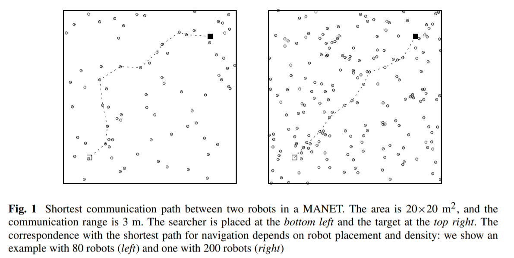
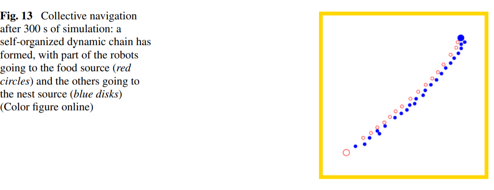
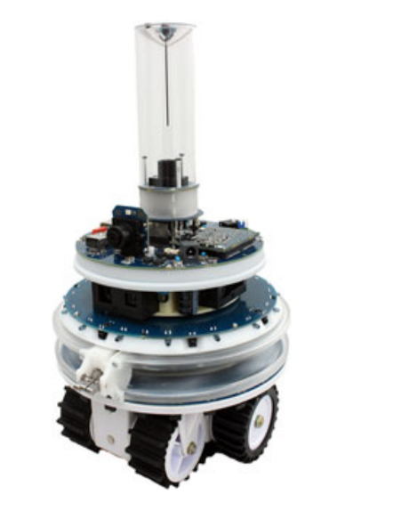
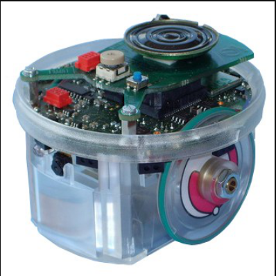
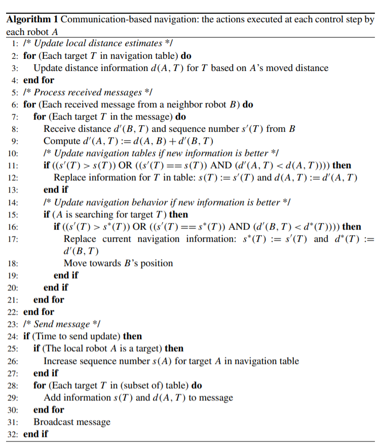
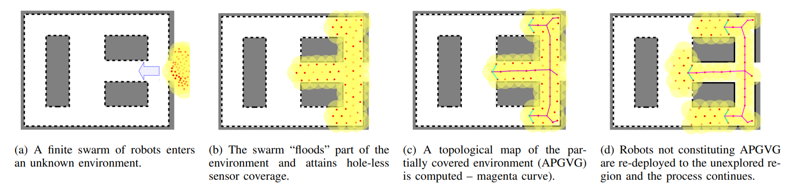
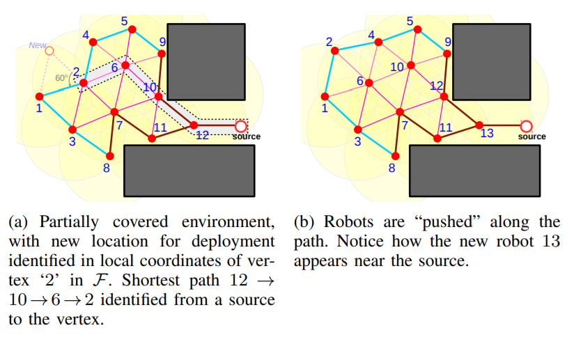
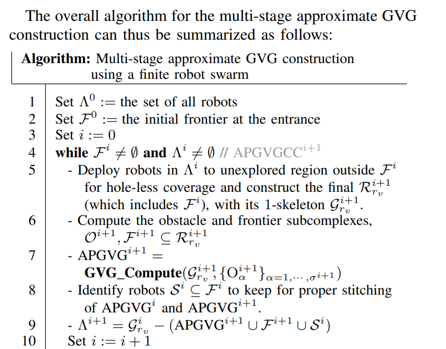

# Bibliographic Revision

## Cooperative Navigation in Robotic Swarms

__T__ : a target robot

__S__ :  robot of the swarm that can service the task, needs to navigate to a given target robot T.

__Task__ :  S have to find T through cooperative support from the other robots in the swarm when no environment maps or external localization systems are available to the robots. The other robots offer help through communication but do not deviate from their task. (differs from the typical ones previously considered in swarm navigation, in which some robots adapt their own behavior (or even stand still playing the role of environment landmarks) to support the navigation of other robots, or, more in general, where all robots are involved in solving a single task cooperatively)

### Requirements

###### Wireless Communication Device

Should have line-of-sight communication and be able to link received messages to relative position information (angle and distance) about their sender : infrared range-and-bearing (IrRB) communication system -  foot-bot robots 

10 bytes, and has a capacity of 10 messages per second           ----------2 bytes/s, with significant packet loss, and very noisy range and bearing estimates

 

Other options: RSS (Received Signal Strength), TOA (Time of Arrival) and/or TDOA (Time Difference of Arrival) of two signals that are known to have different propagation speeds.(As the measurement techniques presented rely on signal propagation characteristics, a threshold distance for such measurements has to be considered)

Other: [ A.O. de Sá et al.](../Papers/Related/neurocomputing.pdf) : Particle Swarm Optimization (PSO) and Backtracking Search Algorithm (BSA).

### Algorithm

 Each robot A coming in communication range of a target robot T , and receiving its periodic broadcasts, stores information about T in a local data structure, which we call a **navigation table**. This information consists of a sequence number, indicating the relative age of the message, and a distance value, which is an estimate of the navigation distance to T . As A moves around, it updates the information in its navigation table, and periodically broadcasts it to neighboring robots. This way, navigation information can travel through the (possibly intermittently connected) mobile ad hoc network (MANET) formed among the swarm of robots by being carried on board of the mobile robots. A searching robot S receiving new navigation information from a robot B, compares this new information to previously received navigation information, and moves towards B’s location if the new information is better.

# Creation of topological map

​	

This method involves covering part of the free space of an environment prior to constructing a Generalized Voronoi Graph from the covered space. The excess robots are then used to extend the covered space and further construct a GVG of the environment until a full topological representation is completed. 

## Scarab robot

Every robot is only equipped with a bearing sensor with limited range that allows a robot to detect the bearing of neighbors, and a touch sensor that allows a robot to perform obstacle avoidance. Additionally, robots are capable of communicating with their neighbors. As a result, robots do not have access to metric information and cannot localize themselves in any meaningful coordinate system. Our algorithm allows the swarm of robots to construct an approximate GVG of the environment. The graph must be approximate since robots lack the ability to make metric measurements. Further since all sensors are local, the graph must be constructed incrementally.

### Algorithm 

The overall algorithm involves a sequence of deployment cycles, each of which consists of identifying frontier robots, locations (in local coordinates of the frontier robots) for deployment of new robots, and thus executing a “push” action through the graph so as to deploy a new robot into the coverage network.

